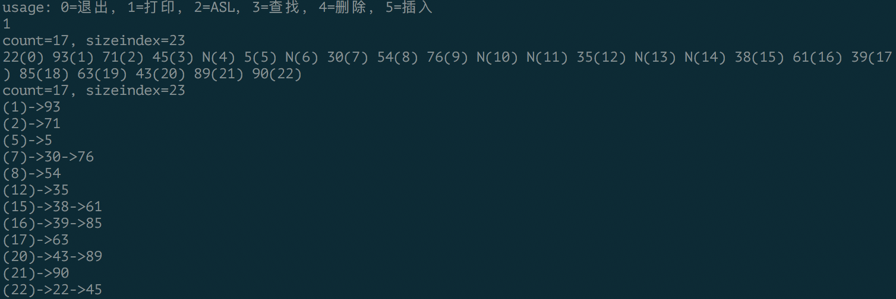
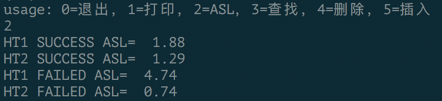
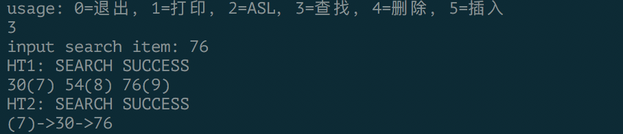
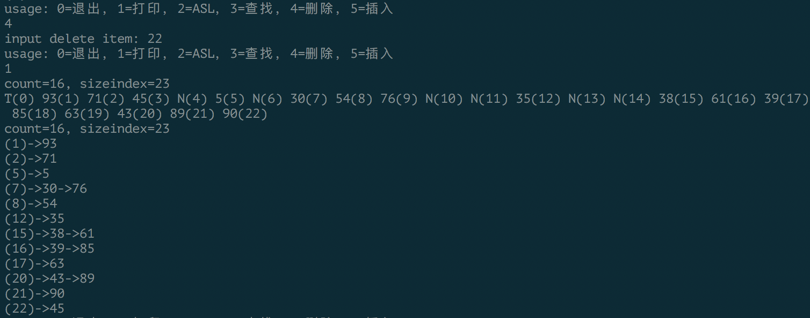
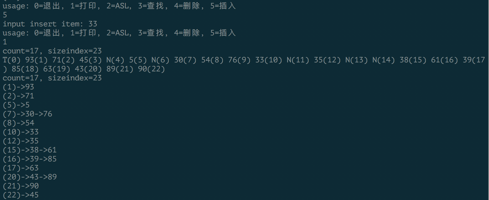

# 问题描述
## 实验题目
构造哈希表，分别用线性探测法和拉链法解决冲突
## 基本要求
1. 实现关键字的插入、删除、查找
2. 计算等概率查找成功和失败的ASL
# 概要设计
哈希函数统一使用除留余数法，线性探测法针对线性存储的哈希表，拉链法针对链式存储的哈希表。两种数据结构分别命名为**HashTable**和**ChainHash**
## 数据结构定义
**HashTable**包含数组头指针项*elem*，整型项*count*指示表中已有的元素个数，整型项*sizeindex*指示表的大小；**ChainHash**和前者不同之处在于所包含的是指针数组*chainlist*，数组中每个元素是一个链表的头指针。链表结点是结构体*ChainNode*
```c
typedef int ElemType;
typedef struct {
  ElemType *elem;
  int count;
  int sizeindex;
} HashTable;

typedef struct ChainNode {
  ElemType elem;
  struct ChainNode *next;
} *Chain;
typedef struct {
  Chain *chainlist;
  int count;
  int sizeindex;
} ChainHash;
```
## API
由于有两种结构不同的哈希表，相应的定义了两套类似的操作函数
```c
// HashTable API
Status CreateHash(HashTable *, int);                  // 创建
Status InsertHash(HashTable *, ElemType);             // 插入关键字
Status SearchHash(HashTable, ElemType, int *, int *); // 查找关键字
Status DeleteHash(HashTable *, ElemType );            // 删除关键字
void PrintHash(HashTable);                            // 打印哈希表
Status DestroyHash(HashTable *);                      // 销毁
// ChainHash API
Status CreateChainHash(ChainHash *, int);                    // 创建
Status InsertChainHash(ChainHash *, ElemType);               // 插入关键字
Status SearchChainHash(ChainHash, ElemType, Chain *, int *); // 查找关键字
Status DeleteChainHash(ChainHash *, ElemType);               // 删除关键字
void PrintChainHash(ChainHash);                              // 打印哈希表
Status DestroyChainHash(ChainHash *);                        // 销毁
// 公用函数
void ASL(void);
```
## 源文件组织
main.c 包含了数据结构定义，相应函数实现和主程序代码
# 算法思路
## 墓碑
线性存储的**HashTable**在删除关键字时用预先定义的*TOMBKEY*代替其位置，即设立一个墓碑。此外还有一个预先定义的*NULLKEY*用于标记空元素。墓碑和空元素有所区别：在查找关键字时，由于采用了线性探测法解决冲突，给定关键字会沿着哈希表向前逐个比较，如果遇到空元素则说明表中没有该关键字，如果遇到墓碑则说明此处关键字被删除但是仍可继续向前比较。

由于这个问题只可能出现在查找过程中，所以对于墓碑的特殊处理写在函数**SearchHash**中，它的做法是除非遇见空元素或者找到关键字，否则持续向前查找。由于查找关键字失败时，该函数还需返回该关键字可插入的位置，若在查找过程中存在墓碑，则第一个墓碑位置即是可插入位置。根据此，**SearchHash**函数在向前查找的过程中会记录下第一个墓碑的位置。
## ASL(平均查找长度)
对于等概率查找成功的ASL计算，**ASL**函数逐个查找哈希表中已有元素并且记录每个元素查找过程中的比较次数，求和取平均即得到等概率查找成功的ASL。

对于等概率查找失败的ASL计算，若是线性探测法解决冲突，则对每个位置都有其到向前第一个空元素的距离，把这些距离求和取平均即得ASL；若是拉链法，则每个位置都有对应的链表长度，把这些长度求和取平均即得ASL。
# 程序测试
给定哈希关键字序列{43, 71, 93, 35, 89, 05, 38, 90, 61, 30, 54, 39, 76, 85, 63, 22, 45}
## 打印
**HashTable**打印格式为“关键字(地址)”，其中N代表空元素，T代表墓碑
**ChainHash**打印格式为“(地址)->链表”

## ASL

## 查找
查找关键字76，并打印出比较序列

## 删除
删除关键字22

## 插入
插入关键字33

