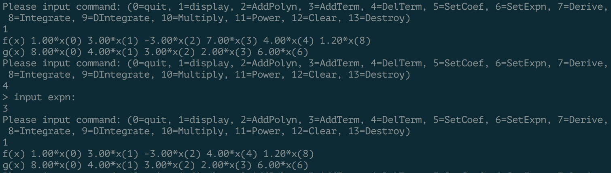

# 问题描述
## 实验题目
利用链式存储结构实现一元多项式的运算
## 基本要求
必做：一元多项式的创建、显示、求和（求差）、求值；销毁、清空、修改（添加项、删除项、修
改系数或指数）

选做：微分（N阶）、不定积分、定积分、乘法、除法、乘方
# 概要设计
存储结构为链表，链表的每个结点代表多项式中的一项，包含系数和指数。要求系数为非零
浮点数，指数为整数。整个链表各结点按指数排序链接在一起，不存在指数相同的结点。链
表头结点不属于多项式，尾结点的*next*指针必须为空。
## 数据结构定义
定义**term**为单个项，该结构体包含系数*coef*、指数*expn*和结构体指针*next*，**polynomial**为**term**的链表
```c
typedef struct term{
	float coef;
	int expn;
	struct term *next;
} term, *polynomial;
```
## API
```c
polynomial CreatePolyn (int);        // Create a polynomial
Status DestroyPolyn (polynomial *);  // Destroy a polynomial
Status ClearPolyn (polynomial );     // Clear a polynomial
void PrintPolyn (polynomial );       // Print a polynomial
int PolynLength (polynomial );       // Return length of polynomial
void AddPolyn (polynomial A, polynomial B);       // A->A+B, then clear B
void SubtractPolyn (polynomial A, polynomial B);  // A->A-B, then clear B
void MultiplyPolyn (polynomial A, polynomial B);  // A->A*B, then clear B
void PowerPolyn (polynomial, int);                // Power a polynomial 
void DerivePolyn (polynomial, polynomial, int);   // Derivation of a polynomial
void IntPolyn (polynomial, polynomial, int);      // Integrate of a polynomial
float DIntPolyn (polynomial, int, float, float);  // Integrate with up and down bound
Status CalcValue (polynomial, float, float *);    // Value of a polynomial
Status AddTerm (polynomial , float, int);         // Add a term to a polynomial
Status DelTerm (polynomial, int);                 // Del a term from a polynomial
Status SetCoef (polynomial, float, int);          // Set the cofficient of a term
Status SetExpn (polynomial, int, int);            // Set the expn of a term
Status CopyPolyn (polynomial, polynomial );       // Copy a polynomial
```
## 源文件组织
- Polynomial.h: 提供数据结构定义和相关函数声明
- Polynomial.c: 实现同名头文件中声明的函数
- main.c: 主程序源文件
# 算法思路
为了保证整个链表有序，没有不合要求的结点，在对链表内容进行修改时都需要额外的检查。
## AddTerm函数
在创建等多个函数里都调用了AddTerm
```c
Status AddTerm (polynomial P, float coef, int expn)
```
该函数根据给定的系数和指数分配结点，然后将结点插入给定的链表，并且保证插入后整个
链表仍然符合设计要求。流程如下
1. 判断给定系数、指数、链表是否符合要求
2. 遍历链表寻找插入位置
3. 若链表中有指数更大的项，插入在它前面
4. 若链表中有指数相同的项，与其系数相加并判断是否为0
5. 若遍历结束，插入到链表尾部
## 遍历技巧
由于涉及到了链表的操作，遍历链表需要一定技巧。定义两个指向结点的指针*eb*和*ef*，
分别指向相邻的前后结点，初始值为头结点和多项式第一项。总将*ef*指向的项作为当前项
进行操作。
```c
term *eb = P, *ef = P->next;
while (ef) {
    // some operations
    // ...
    eb = eb->next;
    ef = ef->next;
}
```
# 程序测试
设定多项式f(x)和g(x)
## 多项式相加

## 添加项
向f(x)添加一项

## 删除项
从f(x)中删除一项

## 修改系数

## 修改指数

## 求导

## 不定积分

## 定积分

## 多项式相乘

## 乘方

