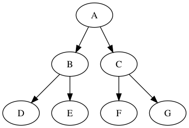

# 问题描述
## 实验题目
二叉树的实现
## 基本要求
1. 创建二叉树并简单打印
2. 遍历二叉树 (先序、中序、后序、层序遍历)
3. 二叉树的计算 (结点数、叶子数、高度、宽度)
4. 二叉树的处理 (复制、镜像、销毁)
5. 二叉树的查找 (找结点、找双亲、找孩子、找兄弟、找祖先)
6. 判断 (二叉排序树、完全二叉树)
# 概要设计
二叉树只有一个根结点，每个结点至多有两个子结点，至多有一个双亲结点。任一结点及其子孙结点合起来也可以视为一棵二叉树。
## 数据结构定义
定义二叉树结点**BTNode**，这是一个结构体，包含数据项*data*和三个指向**BTNode**的指针 (左孩子*lchild*，右孩子*rchild*，双亲*parent*)。定义二叉树类型**BiTree**，是一个指向**BTNode**的指针。
```c
typedef char TElemType;
typedef struct BTNode {
  TElemType data;
  struct BTNode *lchild, *rchild, *parent;
} BTNode, *BiTree;
```
## API
```c
Status CreateBiTree(BiTree* );          // 创建
Status PrintBiTree(BiTree );            // 打印
Status ClearBiTree(BiTree *);           // 清空
Status CopyBiTree(BiTree, BiTree *);    // 复制
Status MirrorBiTree(BiTree, BiTree *);  // 镜像
Status PreOrderTraverse(BiTree, Status(*)(BiTree ) );   // 先序遍历
Status InOrderTraverse(BiTree, Status(*)(BiTree ) );    // 中序遍历
Status PostOrderTraverse(BiTree, Status(*)(BiTree ) );  // 后序遍历
Status LevelOrderTraverse(BiTree, Status(*)(BiTree ));  // 层序遍历
BiTree Root(BiTree );                   // 返回二叉树根结点指针
BiTree Parent(BiTree);                  // 返回指定结点的双亲结点指针
BiTree FindNode(BiTree, TElemType);     // 返回data项与给定参数相同的结点指针
BiTree Sibling(BiTree);                 // 返回指定结点的兄弟结点指针
BiTree Ancestor(BiTree, BiTree);        // 返回两个结点的祖先结点指针
int NodeNumBiTree(BiTree );             // 结点数
int LeafNumBiTree(BiTree );             // 叶子数 
int HeightBiTree(BiTree );              // 高度
int WidthBiTree(BiTree );               // 宽度
int IsBST(BiTree);                      // 判断是否二叉排序树
int IsBCT(BiTree);                      // 判断是否完全二叉树
```
## 源文件组织
- BiTree.h: 提供数据结构定义和相关函数声明
- BiTree.c: 实现同名头文件中声明的函数
- BiTreeQueue.h: 定义二叉树元素的队列
- BiTreeQueue.c: 实现同名头文件中声明的函数
- main.c: 主程序源文件
# 算法思路
二叉树中的一些操作用到了队列，所以我相应的定义了二叉树的队列。先中后序遍历用了递归形式。层序遍历用了队列，流程如下：
1. 二叉树根结点入队
2. 若队列非空，则元素出队，访问该元素，该元素左右孩子结点入队
  这里谈谈具体实现时的一些问题
## 复制和镜像
函数*CopyBiTree*和*MirrorBiTree*所用的思路都是一样的。给定二叉树A和B，要求使B成为A的复制或镜像，流程如下：
1. 清空二叉树B
2. 创建队列QA和QB，分别用于存储A和B的结点
3. A树根结点入队QA
4. 复制A树根结点作为B树根结点入队QB
5. QA元素出队，其左右/右左孩子结点依次入队QA (取决于是复制还是镜像)，复制这两个孩子结点；QB元素出队，出队元素和刚才的复制结点进行连接，使它们成为自己的孩子结点，然后这两个结点依次入队QB；重复此步骤直到QA为空队列
## 查找结点
为了简便，**FindNode**先初始化全局变量，然后直接调用先序遍历函数，用**FindBTNode**逐个访问结点判断其*data*项是否为待查项。定义了三个全局变量：
- *nodefound*：查找到的结点指针，初始值为空
- *flagfound*：是否已经查找到符合要求的结点
- *target*：待查的项
## 寻找祖先
祖先结点根据定义是离给定两结点最近的共同祖先。若给定两结点是T1和T2，函数思路是T1一路沿双亲结点向上直到根结点，并且把每个经过的结点存入一个二叉树数组。然后T2一路沿双亲结点向上直到根结点，并且判断每个结点是否在刚才的数组中，若判断为真，则该结点是祖先，将其返回。
## 判断二叉排序树
将给定二叉树中序遍历，每个结点的*data*项存入全局变量数组*BSTdatas*中，遍历结束后判断该数组是否递增，若是，则给定树为二叉排序树。
# 程序测试

构造树

## 打印
先序

中序

后序

层序
